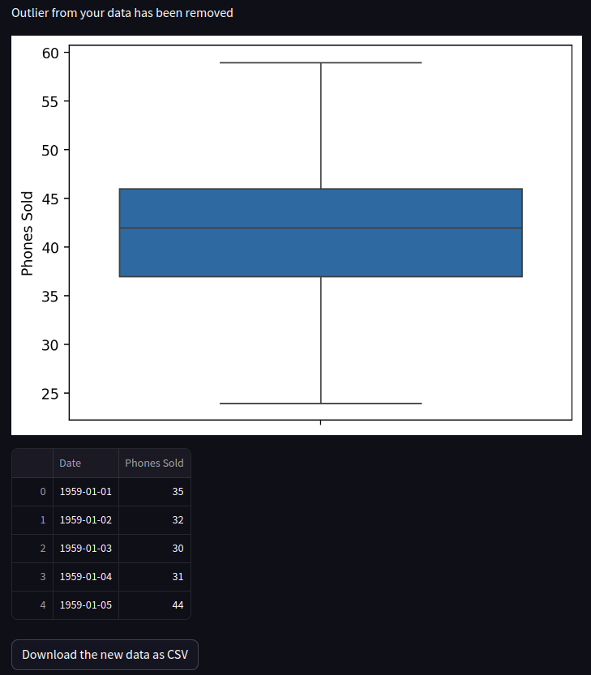

# Outlier Removal using Statistics
Ths repository contains the code for the outlier removal demo by using stats. You can visualize the data, spot and remove the outliers and download the new clean data.


Usage:
```
streamlit run outlier_removal.py
```

Results:


